# Domínio: Research

Behaviors do domínio de **pesquisa e descoberta de termos** do projeto IDeiaPages.

Este é o **primeiro domínio executado** no projeto (Fase 0 do plano), porque sem termos validados, qualquer página é chute.

---

## Behaviors deste domínio

| # | Behavior | Contrato | O que faz |
|---|----------|----------|-----------|
| 0 | `data-model` | [contract.md](./data-model/contract.md) | Materializa as tabelas Supabase do domínio (pré-requisito de tudo) |
| 1 | `collect-autocomplete` | [contract.md](./collect-autocomplete/contract.md) | Coleta autocomplete + PAA do Google para um seed |
| 2 | `collect-serp` | [contract.md](./collect-serp/contract.md) | Snapshot SERP top 10 por termo |
| 3 | `scrape-competitors` | [contract.md](./scrape-competitors/contract.md) | Raspa markdown limpo das URLs concorrentes (Firecrawl) |
| 4 | `collect-trends` | [contract.md](./collect-trends/contract.md) | Tendência Google Trends por keyword (pytrends) |
| 5 | `classify-terms` | [contract.md](./classify-terms/contract.md) | Classifica intent + score + tipo de página via Claude |
| 6 | `analyze-gaps` | [contract.md](./analyze-gaps/contract.md) | Identifica gaps de Information Gain (briefing SEO) via Claude |

> **Spec única da fase**: o "O QUÊ" desta fase está em [`specs/fase-0-research-pipeline.md`](../../specs/fase-0-research-pipeline.md). Cada `contract.md` aqui detalha o comportamento operacional do módulo de código correspondente.

---

## Pipeline conceitual

```mermaid
flowchart LR
  seeds[seeds/ideia_chat.json]
  seeds --> A[collect-autocomplete]
  A --> termos[(termos)]
  termos -->|status=coletado| C[classify-terms]
  C -->|status=analisado| T[collect-trends]
  T -->|priorizar score>=7| pri[status=priorizado]
  pri --> S[collect-serp]
  S --> snaps[(serp_snapshots)]
  snaps --> SC[scrape-competitors]
  SC --> conc[(conteudo_concorrente)]
  conc --> AG[analyze-gaps]
  AG --> brief[(briefings_seo)]
  brief -->|status=briefing_pronto| out[Pronto para Fase 2: generation]
```



---

## Ordem de execução

A **implementação** segue dependência:

1. **`data-model`** primeiro (cria tabelas)
2. Depois, em qualquer ordem (cada um isolado):
   - `collect-autocomplete`
   - `collect-trends`
3. **`classify-terms`** depende de termos coletados
4. **`collect-serp`** pode rodar em paralelo (não depende de classify)
5. **`scrape-competitors`** depende de `collect-serp`
6. **`analyze-gaps`** depende de `scrape-competitors` + `classify-terms`

A ordem global das issues é definida pelo `/break fase-0-research-pipeline`, que gera o DAG completo em `specs/fase-0-research-pipeline.break.md`.

---

## Como começar

```bash
# 1. Decompor a fase em issues
/break fase-0-research-pipeline

# 2. Planejar e executar a primeira issue do caminho crítico (data-model)
/plan research/data-model/01-create-termos
/execute research/data-model/01-create-termos

# 3. Continuar pelas próximas issues do DAG
/plan research/data-model/02-create-serp-snapshots
/execute research/data-model/02-create-serp-snapshots
# ... etc

# Quando todos os behaviors estiverem implementados:
cd research
uv run ideiapages-research run-pipeline --seed-file ../seeds/ideia_chat.json
```

---

## Próxima fase

Quando o domínio research entregar **20-50 termos com `status = 'briefing_pronto'`**, passamos para o domínio `generation` (Fase 2 — gerar páginas multi-IA).
