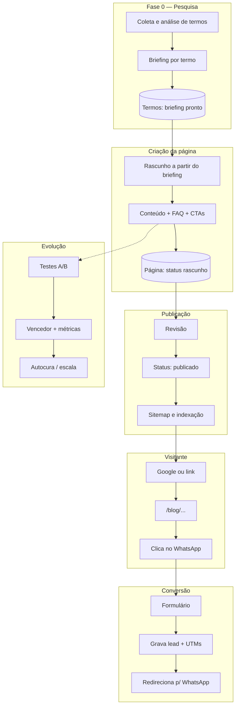
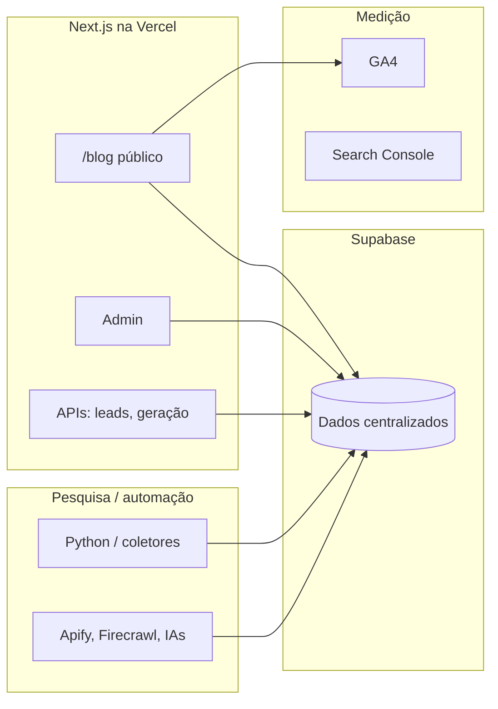

# IDeiaPages — fluxo do projeto (Mermaid)

Documento de referência com os mesmos diagramas exibidos no Canvas do Cursor
(`canvases/fluxo-ideiapages.canvas.tsx` na pasta do projeto no Cursor).

## Diagrama principal

## Camadas técnicas

---

*Atualizado em 23/04/2026. Alinhado a `ideiapages/README.md` e às specs de fase.*
