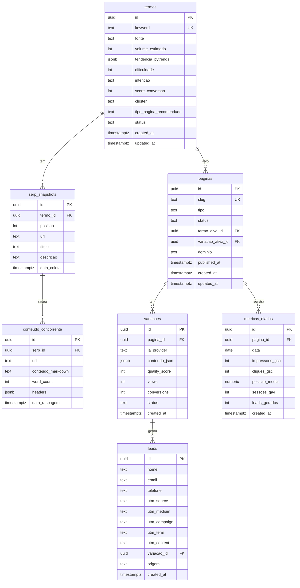

# Data Model — IDeiaPages

> Esquema canônico do banco. Lido por `model-writer`. Migrations em `supabase/migrations/`.

---

## Princípios

1. **Migrations versionadas** — todo schema vem de SQL em `supabase/migrations/NNNN_description.sql`
2. **RLS sempre ativa** — toda tabela tem `enable row level security` + policies explícitas
3. **Tipos gerados** — `supabase gen types typescript --local > web/src/lib/database.types.ts`
4. **Naming**: tabelas no plural, colunas em `snake_case`, IDs em `uuid` com `default gen_random_uuid()`
5. **Timestamps**: toda tabela tem `created_at` e `updated_at` com triggers
6. **Soft delete**: usar `deleted_at` nullable em vez de delete físico para entidades importantes

---

## Esquema canônico



---

## Tabelas detalhadas

### `termos`
Pesquisa: cada termo descoberto + análise.

| Coluna | Tipo | Notas |
|--------|------|-------|
| `id` | uuid | PK |
| `keyword` | text | UNIQUE, NOT NULL, lowercase |
| `fonte` | text | `autocomplete`, `paa`, `seed`, `related` |
| `volume_estimado` | int | nullable (vem do pytrends/inferência LLM) |
| `tendencia_pytrends` | jsonb | série temporal + relacionados |
| `dificuldade` | int | 1-100, inferida pelo LLM |
| `intencao` | text | `informacional`, `transacional`, `comparativa`, `navegacional` |
| `score_conversao` | int | 1-10, definido pelo LLM |
| `cluster` | text | agrupamento temático |
| `tipo_pagina_recomendado` | text | `landing`, `blog`, `comparison`, `faq`, `guide` |
| `status` | text | `coletado`, `analisado`, `priorizado`, `descartado` |

### `serp_snapshots`
Top resultados do Google por termo no momento da coleta.

### `conteudo_concorrente`
Conteúdo raspado dos top URLs (Firecrawl) para análise de gaps.

### `paginas`
Cada página publicada (uma página tem N variações, mas 1 ativa).

| Coluna | Tipo | Notas |
|--------|------|-------|
| `slug` | text | UNIQUE, lowercase, hífen |
| `tipo` | text | `landing`, `blog`, `comparison`, `faq`, `guide` |
| `status` | text | `draft`, `review`, `published`, `archived` |
| `dominio` | text | default `ideiamultichat.com.br` |

### `variacoes`
A/B testing: cada página pode ter 2-3 variações de copy.

### `leads`
Captura de leads — sempre **antes** de redirecionar para WhatsApp.

### `metricas_diarias`
Snapshot diário de performance para dashboard e autocura.

---

## RLS Policies

### Padrão geral

- **Service role**: acesso total (usado pelos scripts Python e route handlers).
- **Anon**: leitura apenas de `paginas` com `status = 'published'`. **Nunca** acesso a `leads`, `termos`, etc.
- **Authenticated**: definir quando houver dashboard interno.

### Exceção: insert em `leads`

A inserção de leads vem do route handler (que usa service_role), não do client direto. Policy:

```sql
-- leads: apenas service_role insere
create policy "service role insert leads" on leads
  for insert to service_role with check (true);

-- leads: nenhum select público
create policy "no public select leads" on leads
  for select to anon using (false);
```

---

## Migrations

Estrutura:

```
supabase/migrations/
├── 0001_research_tables.sql       Termos, SERP, conteúdo concorrente
├── 0002_pages_tables.sql          Páginas, variações
├── 0003_leads_table.sql           Leads + RLS
├── 0004_metrics_table.sql         Métricas diárias
└── 0005_triggers.sql              updated_at, soft delete
```

Cada migration é **forward only**. Para reverter, criar nova migration.

---

## Geração de tipos

```bash
cd web
npx supabase gen types typescript --project-id <ID> > src/lib/database.types.ts
```

Adicionar como script `pnpm db:types`.
